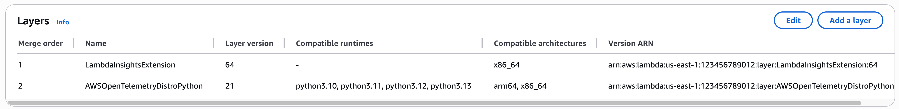
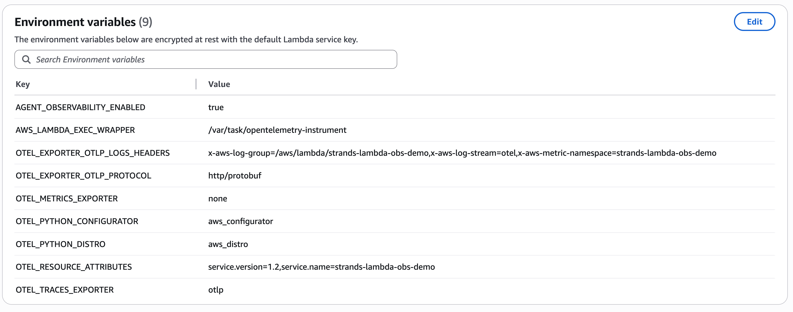

# AgentCore Observability with Strands on AWS Lambda

### Build deployable Zip file
Use provided `build.sh` to create a deployable lambda ZIP package.
1. Run it from the project home directory where `lambda_agent.py` is located.
2. Replace `finch` with `docker`, if using Docker.
```
chmod u+x build.sh
./build.sh
```

### Deploying the package
1. Create an AWS Lambda function for Python 3.13 from scratch
2. Deploy by uploading the zip file created in previous step
3. Verify Lambda runtime setting for correct handler configuration. should say `lambda_agent.handler`.
4. From **Configuration** > **General configuration**, increase `Timeout` to as appropriate. For example, `5 mins`.


### Enable Lambda X-Ray
Enable `Application Signals` and `Lambda service traces`. This will add AWS managed `ADOT` layer to the Lambda function




### Lambda environment variables

1. **AWS_LAMBDA_EXEC_WRAPPER:** Update otel instrumentation location from X-ray layer to locally bundled python instrumentation `/var/task/opentelemetry-instrument`
2. **OTEL_EXPORTER_OTLP_LOGS_HEADERS:** Update `x-aws-log-group`, `x-aws-log-stream` and `x-aws-metric-namespace` as needed for your project
3. **OTEL_RESOURCE_ATTRIBUTES:** Update `service.version` and `service.name` as needed

```
AGENT_OBSERVABILITY_ENABLED=true
AWS_LAMBDA_EXEC_WRAPPER=/var/task/opentelemetry-instrument
OTEL_EXPORTER_OTLP_LOGS_HEADERS=x-aws-log-group=/aws/lambda/strands-lambda-obs-demo,x-aws-log-stream=otel,x-aws-metric-namespace=strands-lambda-obs-demo
OTEL_EXPORTER_OTLP_PROTOCOL=http/protobuf
OTEL_METRICS_EXPORTER=none
OTEL_PYTHON_CONFIGURATOR=aws_configurator
OTEL_PYTHON_DISTRO=aws_distro
OTEL_RESOURCE_ATTRIBUTES=service.version=1.2,service.name=strands-lambda-obs-demo
OTEL_TRACES_EXPORTER=otlp
```



### Lambda execution role permissions
To the Lambda execution role
1. Add necessary Bedrock and AgentCore service permissions as applicable. For example, you can attach `BedrockAgentCoreFullAccess` AWS managed-policy to get started
2. Add inline permission or policy to provide access write to CW logs and X-Ray
```
{
    "Version": "2012-10-17",
    "Statement": [
        {
            "Sid": "CWACloudWatchServerPermissions",
            "Effect": "Allow",
            "Action": [
                "logs:PutLogEvents",
                "logs:PutRetentionPolicy",
                "logs:DescribeLogStreams",
                "logs:DescribeLogGroups",
                "logs:CreateLogStream",
                "logs:CreateLogGroup",
                "xray:PutTraceSegments",
                "xray:PutTelemetryRecords",
                "xray:GetSamplingRules",
                "xray:GetSamplingTargets",
                "xray:GetSamplingStatisticSummaries"
            ],
            "Resource": "*"
        }
    ]
}
```
